# 通知中心 Mock 分角色组织图

```mermaid
flowchart TB
  Center["通知中心 Mock"]

  Center --> Tenant["客户管理员 tenantAdmin"]
  Center --> Sales["销售 sales"]
  Center --> Ops["交付运维 deliveryOps"]
  Center --> OpsAdmin["交付管理员 deliveryAdmin"]
  Center --> Finance["财务 finance"]
  Center --> Admin["超级管理员 platformAdmin"]

  Tenant --> T1["订单支付成功"]
  Tenant --> T2["对公审核已通过"]
  Tenant --> T3["对公审核被驳回"]
  Tenant --> T4["ArkClaw 已开通"]

  Sales --> S1["新咨询留资已分配"]
  Sales --> S2["客户已付款"]
  Sales --> S3["客户 ArkClaw 已开通"]
  Sales --> S4["佣金已到账"]
  Sales --> S5["客户归属已变更"]

  Ops --> O1["交付工单已分配给你"]
  Ops --> O2["支持工单已分配给你"]
  Ops --> O3["对公流水号待录入"]

  OpsAdmin --> OA1["交付工单已分配给你"]
  OpsAdmin --> OA2["支持工单已分配给你"]
  OpsAdmin --> OA3["对公流水号待录入"]

  Finance --> F1["对公审核待财务复核"]
  Finance --> F3["发票申请待处理"]
  Finance --> F4["佣金结算待处理"]

  Admin --> A1["新企业已注册"]
```

文本版：

| 角色 | 当前 mock 通知 |
|---|---|
| 客户管理员 tenantAdmin | 订单支付成功、对公审核已通过、对公审核被驳回、ArkClaw 已开通 |
| 销售 sales | 新咨询留资已分配、客户已付款、客户 ArkClaw 已开通、佣金已到账、客户归属已变更 |
| 交付运维 deliveryOps | 交付工单已分配给你、支持工单已分配给你、对公流水号待录入 |
| 交付管理员 deliveryAdmin | 交付工单已分配给你、支持工单已分配给你、对公流水号待录入 |
| 财务 finance | 对公审核待财务复核、发票申请待处理、佣金结算待处理 |
| 超级管理员 platformAdmin | 新企业已注册 |
